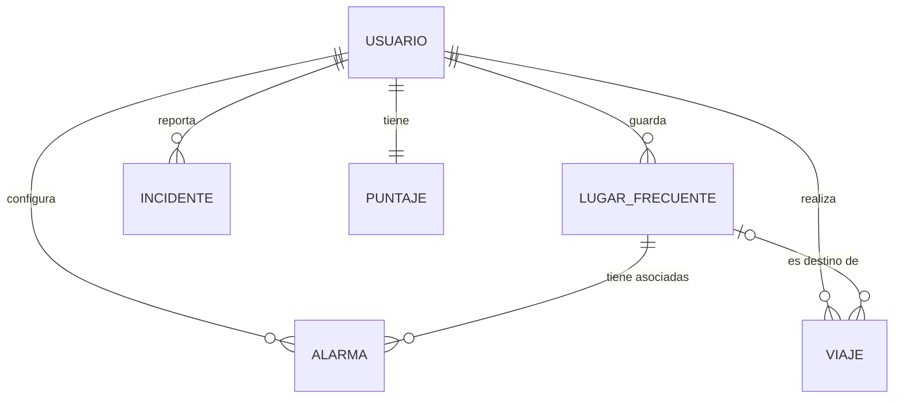

# Modelo de datos — EcoRuta MVP

Documento de la estructura de datos persistida localmente por la app.
Responsable: Franco (Analista). Versión: Sprint 2.

## Criterios generales

- **Persistencia:** toda la información del usuario se guarda localmente con `sqflite` (base `ecoruta.db`). No hay backend propio.
- **Autenticación:** la maneja Firebase Auth. Localmente solo se guarda una caché mínima del usuario, **nunca la contraseña**.
- **Datos de Google:** no se guardan datos crudos de Google Maps/Routes (polilíneas, tiempos, tráfico), por sus condiciones de uso. Solo se guarda lo que genera el propio usuario.
- **Claves foráneas:** SQLite las trae desactivadas. Se activan con `PRAGMA foreign_keys = ON` en el `onConfigure` de `DatabaseHelper`, si no el `ON DELETE CASCADE` no funciona.
- **Nombres de columnas:** `camelCase`, igual que los atributos de las clases en `modelos/`, para que `toMap()`/`fromMap()` coincidan sin traducción.
- **Identificadores:** `TEXT`. El del usuario es el `uid` de Firebase; el resto se genera en la app.

## Diagrama entidad-relación



## Cardinalidades

| Relación | Tipo | Explicación |
|---|---|---|
| Usuario → Lugar frecuente | 1 a N | Un usuario guarda muchos lugares; cada lugar pertenece a un solo usuario |
| Usuario → Alarma | 1 a N | Un usuario configura muchas alarmas; cada alarma pertenece a un solo usuario |
| Usuario → Incidente | 1 a N | Un usuario reporta muchos incidentes; cada incidente tiene un solo autor |
| Usuario → Viaje | 1 a N | Un usuario realiza muchos viajes; cada viaje es de un solo usuario |
| Usuario → Puntaje | 1 a 1 | Cada usuario tiene un único puntaje acumulado |
| Lugar frecuente → Alarma | 1 a N | Un lugar puede tener varias alarmas; cada alarma apunta a un solo lugar |
| Lugar frecuente → Viaje | 0..1 a N | Un viaje puede tener como destino un lugar frecuente, o una dirección libre |

## Entidades

### Usuario (`usuarios`)

Caché local de los datos de Firebase Auth.

| Campo | Tipo | Restricción | Descripción |
|---|---|---|---|
| id | TEXT | PK | `uid` de Firebase |
| email | TEXT | NOT NULL | Email de la cuenta |
| nombre | TEXT | NOT NULL | Nombre visible (de Google o del registro) |
| metodoAuth | TEXT | NOT NULL | `email` o `google` |
| fechaAlta | TEXT | NOT NULL | Fecha ISO 8601 del primer ingreso |

### Lugar frecuente (`lugares_frecuentes`)

| Campo | Tipo | Restricción | Descripción |
|---|---|---|---|
| id | TEXT | PK | Identificador generado en la app |
| usuarioId | TEXT | NOT NULL, FK → usuarios.id | Dueño del lugar |
| nombre | TEXT | NOT NULL, no vacío | Ej: "Casa", "Trabajo" |
| direccion | TEXT | NULL | Dirección textual para mostrar en la lista |
| latitud | REAL | NOT NULL | Elegida en el mapa o por búsqueda |
| longitud | REAL | NOT NULL | Elegida en el mapa o por búsqueda |
| icono | TEXT | NOT NULL | Emoji elegido por el usuario |
| orden | INTEGER | NOT NULL | Posición en la lista (reordenable) |

### Alarma (`alarmas`)

| Campo | Tipo | Restricción | Descripción |
|---|---|---|---|
| id | TEXT | PK | Identificador generado en la app |
| usuarioId | TEXT | NOT NULL, FK → usuarios.id | Dueño de la alarma |
| lugarId | TEXT | NOT NULL, FK → lugares_frecuentes.id, ON DELETE CASCADE | Lugar al que se asocia |
| hora | TEXT | NOT NULL | Formato `HH:mm` |
| dias | TEXT | NOT NULL | Días de la semana separados por coma (1 = lunes … 7 = domingo) |
| activa | INTEGER | NOT NULL | 1 = activa, 0 = desactivada |
| orden | INTEGER | NOT NULL | Posición en la lista |

### Incidente (`incidentes`)

| Campo | Tipo | Restricción | Descripción |
|---|---|---|---|
| id | TEXT | PK | Identificador generado en la app |
| usuarioId | TEXT | NOT NULL, FK → usuarios.id | Autor del reporte |
| tipos | TEXT | NOT NULL | Tipos marcados, separados por `\|` |
| descripcion | TEXT | NOT NULL | Texto libre (puede ser vacío) |
| calle | TEXT | NOT NULL | Calle o intersección de referencia |
| latitud | REAL | NOT NULL | Ubicación autodetectada por GPS |
| longitud | REAL | NOT NULL | Ubicación autodetectada por GPS |
| foto | TEXT | NOT NULL | Ruta local de la imagen (vacío si no hay) |
| fecha | TEXT | NOT NULL | Fecha ISO 8601 del reporte |

### Viaje (`viajes`) — Sprint 5

Registro de cada ruta que el usuario siguió. Es la base para calcular los puntos. No guarda la ruta de Google, solo el hecho de que el viaje ocurrió.

| Campo | Tipo | Restricción | Descripción |
|---|---|---|---|
| id | TEXT | PK | Identificador generado en la app |
| usuarioId | TEXT | NOT NULL, FK → usuarios.id | Quién hizo el viaje |
| origen | TEXT | NOT NULL | Texto del origen |
| destino | TEXT | NOT NULL | Texto del destino |
| lugarDestinoId | TEXT | NULL, FK → lugares_frecuentes.id, ON DELETE SET NULL | Si el destino fue un lugar frecuente |
| fechaSalida | TEXT | NOT NULL | Fecha ISO 8601 |
| fechaLlegada | TEXT | NULL | Fecha ISO 8601 (si se completó) |
| enHoraPico | INTEGER | NOT NULL | 1 si se hizo en franja pico |
| puntos | INTEGER | NOT NULL | Puntos otorgados por el viaje |

### Puntaje (`puntajes`) — Sprint 5

| Campo | Tipo | Restricción | Descripción |
|---|---|---|---|
| usuarioId | TEXT | PK, FK → usuarios.id | Dueño del puntaje |
| puntosTotales | INTEGER | NOT NULL | Suma acumulada |
| ultimaActividad | TEXT | NULL | Fecha ISO 8601 del último viaje con puntos |

## Esquema SQL

```sql
CREATE TABLE usuarios(
  id TEXT PRIMARY KEY,
  email TEXT NOT NULL,
  nombre TEXT NOT NULL,
  metodoAuth TEXT NOT NULL,
  fechaAlta TEXT NOT NULL
);

CREATE TABLE lugares_frecuentes(
  id TEXT PRIMARY KEY,
  usuarioId TEXT NOT NULL,
  nombre TEXT NOT NULL,
  direccion TEXT,
  latitud REAL NOT NULL,
  longitud REAL NOT NULL,
  icono TEXT NOT NULL,
  orden INTEGER NOT NULL,
  FOREIGN KEY(usuarioId) REFERENCES usuarios(id) ON DELETE CASCADE
);

CREATE TABLE alarmas(
  id TEXT PRIMARY KEY,
  usuarioId TEXT NOT NULL,
  lugarId TEXT NOT NULL,
  hora TEXT NOT NULL,
  dias TEXT NOT NULL,
  activa INTEGER NOT NULL,
  orden INTEGER NOT NULL DEFAULT 0,
  FOREIGN KEY(usuarioId) REFERENCES usuarios(id) ON DELETE CASCADE,
  FOREIGN KEY(lugarId) REFERENCES lugares_frecuentes(id) ON DELETE CASCADE
);

CREATE TABLE incidentes(
  id TEXT PRIMARY KEY,
  usuarioId TEXT NOT NULL,
  tipos TEXT NOT NULL,
  descripcion TEXT NOT NULL,
  calle TEXT NOT NULL,
  latitud REAL NOT NULL,
  longitud REAL NOT NULL,
  foto TEXT NOT NULL,
  fecha TEXT NOT NULL,
  FOREIGN KEY(usuarioId) REFERENCES usuarios(id) ON DELETE CASCADE
);

CREATE TABLE viajes(
  id TEXT PRIMARY KEY,
  usuarioId TEXT NOT NULL,
  origen TEXT NOT NULL,
  destino TEXT NOT NULL,
  lugarDestinoId TEXT,
  fechaSalida TEXT NOT NULL,
  fechaLlegada TEXT,
  enHoraPico INTEGER NOT NULL,
  puntos INTEGER NOT NULL,
  FOREIGN KEY(usuarioId) REFERENCES usuarios(id) ON DELETE CASCADE,
  FOREIGN KEY(lugarDestinoId) REFERENCES lugares_frecuentes(id) ON DELETE SET NULL
);

CREATE TABLE puntajes(
  usuarioId TEXT PRIMARY KEY,
  puntosTotales INTEGER NOT NULL DEFAULT 0,
  ultimaActividad TEXT,
  FOREIGN KEY(usuarioId) REFERENCES usuarios(id) ON DELETE CASCADE
);
```

## Regla de borrado de lugares frecuentes (HU07, riesgo #15)

Si el usuario elimina un lugar frecuente que tiene alarmas asociadas:

1. La app muestra un aviso con la cantidad de alarmas que se van a borrar.
2. Si confirma, se elimina el lugar y sus alarmas se borran en cascada.
3. Los viajes que lo tenían como destino se conservan, con `lugarDestinoId` en `NULL`.

## Diferencias con el código actual (rama `feature/matias`)

Cambios necesarios para que el código coincida con este modelo:

| Entidad | Cambio |
|---|---|
| Usuario | Quitar `contrasena`, `usuario`, `dni`, `pais`, `ciudad`, `departamento`; agregar `metodoAuth` y `fechaAlta`. La contraseña la maneja Firebase |
| Lugar frecuente | Agregar `usuarioId`; `direccion` pasa a opcional; guardar lat/long reales (hoy se guardan en 0) |
| Alarma | Agregar `usuarioId` |
| Incidente | Agregar `usuarioId`, `latitud` y `longitud` |
| Viaje, Puntaje | Crear modelos y tablas (la pantalla de puntos hoy usa datos hardcodeados) |
| DatabaseHelper | Agregar `onConfigure` con `PRAGMA foreign_keys = ON`, y `onUpgrade` o reinstalar la app al cambiar el esquema |

## Decisiones pendientes del equipo

- ¿Se conservan en el perfil los datos extra del registro actual (DNI, país, ciudad, departamento)? La propuesta de este documento es no pedirlos, porque no los usa ninguna funcionalidad del MVP.
- ¿Un incidente guarda solo la ubicación GPS, o también la calle escrita por el usuario? Este documento propone guardar ambas.